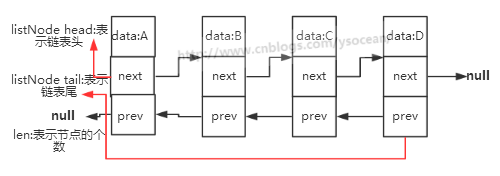
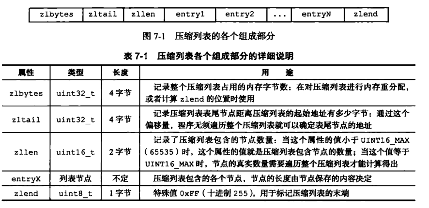

## Redis底层数据结构

[TOC]

### 简单动态字符串(SDS)

#### 数据结构

```C
struct sdshdr{
    //
    int len;
    int free;
    char buf[];
}
```

- len保存了SDS字符串长度
- buf[]数据用来保存字符串的每个元素
- free 记录了buf数组中未使用的字节数量

比C语言实现多出了len属性和free属性

#### Redis字符串特性

**1、常数复杂度获取字符串长度**

由于 len 属性的存在，我们获取 SDS 字符串的长度只需要读取 len 属性，时间复杂度为 O(1)。而对于 C 语言，获取字符串的长度通常是经过遍历计数来实现的，时间复杂度为 O(n)。通过 strlen key 命令可以获取 key 的字符串长度。

**2、杜绝缓冲区溢出**

我们知道在 C 语言中使用 **strcat 函数**来进行两个字符串的拼接，一旦没有**分配足够长度**的内存空间，就会造成缓冲区溢出。而对于 SDS 数据类型，在进行字符修改的时候，会首先根据**记录的 len 属性检查内存空间**是否满足需求，如果不满足，会进行相应的空间扩展，然后在进行修改操作，所以不会出现缓冲区溢出。

**3、减少修改字符串的内存重新分配次数**

C语言由于**不记录字符串的长度，**所以如果要修改字符串，必须要重新分配内存（**先释放再申请**），因为如果没有重新分配，字符串长度增大时会造成内存缓冲区溢出，字符串长度减小时会造成内存泄露。

　　而对于SDS，由于len属性和free属性的存在，对于修改字符串SDS实现了空间预分配和惰性空间释放两种策略：

　　1、空间预分配：对字符串进行空间扩展的时候，**扩展的内存比实际需要的多**，这样可以减少连续执行字符串增长操作所需的内存重分配次数。**（内存泄漏）**

　　2、惰性空间释放：对字符串进行缩短操作时，程序**不立即使用内存重新分配**来回收缩短后多余的字节，而是使**用 free 属性将这些字节的数量**记录下来，等待后续使用。**（内存泄漏）**（当然SDS也提供了相应的API，当我们有需要时，也可以**手动释放这些未使用**的空间。）

**4、二进制安全**

因为c语言以空字符作为字符串的结束表示，而对一些二进制文件（图片），内容可能包含空字符串，因此c语言的字符串无法正确的存储；

而SDS的API都以处理二进制的方式来处理buf里面的元素，并且SDS不是以空字符来判断是否结束，而是以len属性表示的长度来判断字符串是否结束

##### C语言字符串与SDS之间的区别

| C语言字符串                        | Redis-SDS                                |
| ---------------------------------- | ---------------------------------------- |
| 获取长度时间复杂度On               | 获取长度时间复杂度O1                     |
| API不安全可能造成缓冲区溢出        | API安全，不会造成缓冲区溢出              |
| 修改字符串N次会执行N次内存重新分配 | 修改字符串长度N此最多需要N次内存重新分配 |
| 只能保存文本数据                   | 保存文本数据和二进制数据                 |

### 链表

#### 数据结构

##### 单个节点

> 根据其listNode有前置节点和后置节点，可以知道这是一个双向链表

```c
typedef struct listNode{
     //前置节点
     struct listNode *prev;
     //后置节点
     struct listNode *next;
     //节点的值
     void *value; 
}listNode
```

##### 操作链表结构

```c
typedef struct list{
    //表头节点
    listNode *head;
    //表尾节点
    listNode *tail;
    //链表所包含的节点数量
    unsigned  long len;
    //节点值复制函数
    void * free ) ( void *ptr);
    //节点值释放函数
    void (* free ) ( void *ptr);
    //节点值对比函数
    int (*match) ( void *ptr, void *key);
}list;
```



#### Redis链表特性

- 双端：链表具有前置节点和后置节点的引用，获取这两个节点的复杂度都是O1
- 无环：表头节点的pre指针和表尾节点的next指针都是指向NULL，对链表访问都是以NULL结束
- 带链表长度计数器：通过len属性来获取链表长度的时间复杂度为O1
- 多态：链表节点使用void*指针来保存节点值，可以保存各种不同类型的值


### 字典（类似java-hashMap）

字典又称为符号表或者关联数组、或映射（map），是一种用于保存键值对的抽象数据结构。字典中的每一个键 key 都是唯一的，通过 key 可以对值来进行查找或修改。

#### 数据结构

Redis的字典使用哈希表作为底层实现。

##### 哈希表结构定义：

> 哈希表是由数组table组成，table中的每个元素都指向dictEntry结构。

```c
typedef struct dictht{
    //哈希表数组
    dictEntry **table;
    //哈希表大小
    unsigned  long size;
    //哈希表大小掩码，用于计算索引值
    //总是等于 size-1
    unsigned  long sizemask;
    //该哈希表已有节点的数量
    unsigned  long used;
}dictht
```

##### dictEntry

> key用来保存键，val用来保存值，值可以是一个指针，也可以是uint64_t整数，也可以是int64_t整数。
>
> next是指向下一个哈希表节点的指针，这里采用的是链地址法，通过next这个指针可以将多个哈希值相同的键值对连接在一起，用来解决**哈希冲突**。

```c
typedef struct dictEntry{
    //键
    void *key;
    //值
    union {
      void *val;
      uint64_tu64;
      int64_ts64;
    }v;
       //指向下一个哈希表节点，形成链表
    struct dictEntry *next;
}dictEntry
```

 

#### Redis字典特性

- **哈希算法**

  ```c
  #1、使用字典设置的哈希函数，计算键 key 的哈希值
  hash = dict->type->hashFunction(key);
  #2、使用哈希表的sizemask属性和第一步得到的哈希值，计算索引值
  index = hash & dict->ht[x].sizemask;
  ```

- **解决哈希冲突**

  > 方法是链地址法。通过字典里面的 *next 指针指向下一个具有相同索引值的哈希表节点。

- **扩容和收缩** 

  当哈希表保存的键值对太多或者太少时，就要通过 rerehash(重新散列）来对哈希表进行相应的扩展或者收缩。具体步骤：

  1、如果执行扩展操作，会基于原哈希表创建一个大小等于 **ht[0].used*2n** 的哈希表（也就是每次扩展都是根据原哈希表**已使用的空间扩大一倍**创建另一个哈希表）。相反如果执行的是收缩操作，每次收缩是根据已**使用空间缩小一倍**创建一个新的哈希表。

  2、重新**利用上面的哈希算法，计算索引值，**然后将键值对放到新的哈希表位置上。

  3、所有键值对都迁徙完毕后，释放原哈希表的内存空间。

- **触发扩容的条件**

  1、服务器目前没有执行 BGSAVE 命令或者 BGREWRITEAOF 命令，并且负载因子大于等于1。

  2、服务器目前正在执行 BGSAVE 命令或者 BGREWRITEAOF 命令，并且负载因子大于等于5。

  **ps：负载因子 = 哈希表已保存节点数量 / 哈希表大小。**

- **渐进式rehash**

  扩容和收缩操作不是**一次性、集中式**完成的，而是**分多次、渐进式**完成的。在进行渐进式rehash期间，字典的删除查找更新等操作可能会在**两个哈希表**上进行，第一个哈希表没有找到，就会去第二个哈希表上进行查找。但是进行 **增加操作**，一定是在**新的哈希表上**进行的。

### 跳跃表 skiplsit

跳跃表是一种有序的数据结构，通过每个节点中维持多个指向其他节点的指针，从而达到快速访问节点的目的。具有以下性质：

- 由很多层来组成
- 每一层都是一个有序的链表，排序顺序由高层到底层都至少包含两个链表节点，分别是head节点和后面的NIL节点；
- 最底层的链表（level 1）包含了所有的元素
- 如果一个元素出现在某一层（level i）的链表中，那么在该层（level i）下的链表也全都会出现（上层元素是当前层元素的子集）
- 链表中的每个节点都包含两个指针，一个指向同一层的下一节点，另一个指向下一层的同一个链表的节点


#### 数据结构

单个跳跃节点：

> zskiplistLevel 代表着每一层的元素
>
> backward 代表着下一层的元素

```c
typedef struct `zskiplistNode {
    //层
    struct zskiplistLevel{
       //前进指针
       struct zskiplistNode *forward;
       //跨度
       unsigned  int span;
    }level[];
      //后退指针
    struct zskiplistNode *backward;
    //分值
    double score;
    //成员对象
    robj *obj;
} zskiplistNode
```

多个跳跃表节点构成一个跳跃表：

```c
typedef struct zskiplist{
    //表头节点和表尾节点
    structz skiplistNode *header, *tail;
    //表中节点的数量
    unsigned  long length;
    //表中层数最大的节点的层数
    int level;
}zskiplist;
```

 

操作过程：

　①、搜索：从最高层的链表节点开始，如果比**当前节点要大**和比**当前层的下一个节点**要小，那么**则往下找**，也就是和当**前层的下一层的节点**的**下一个节点**进行比较，以此类推，一直找到最底层的最后一个节点，如果找到则返回，反之则返回空。  **简单来说：先比较下一个节点，如果小于则到下一层找，否则就前进到下一个节点，直至找到**

　　②、插入：首先确定插入的层数，有一种方法是假设抛一枚硬币，如果是正面就累加，直到遇见反面为止，最后记录正面的次数作为插入的层数。当确定插入的层数k后，则需要将新元素插入到从底层到k层。（确定该k值的方式是完全随机的）    简单来说：**随机获得k值 确定层数，大于最大层数则取最大层数+1，在其建立新的层数，不是则在k层数中找到其合适的区域**

　　③、删除：在各个层中找到包含指定值的节点，然后将节点从链表中删除即可，如果删除以后只剩下头尾两个节点，则删除这一层。

### 整数集合

整数集合（intset）是Redis用于保存整数值的集合抽象数据类型，它可以保存类型为int16_t、int32_t 或者int64_t 的整数值，并且保证集合中不会出现重复元素。

```c
typedef struct intset{
    //编码方式
    uint32_t encoding;
    //集合包含的元素数量
    uint32_t length;
    //保存元素的数组
    int8_t contents[];
}intset;
```

 

**①、升级**

　　当我们新增的元素类型比原集合元素类型的长度要大时，需要对整数集合进行升级，才能将新元素放入整数集合中。具体步骤：

　　1、根据新元素类型，扩展整数集合底层数组的大小，并为新元素分配空间。

　　2、将底层数组现有的所有元素都转成与新元素相同类型的元素，并将转换后的元素放到正确的位置，放置过程中，维持整个元素顺序都是有序的。

　　3、将新元素添加到整数集合中（保证有序）。

　　升级能极大地节省内存。

### 压缩列表

压缩列表（ziplist）是Redis为了节省内存而开发的，是由一系列特殊编码的**连续内存块组成**的**顺序型**数据结构，一个压缩列表可以包含**任意多个节点**（entry），每个节点可以保存**一个字节数组**或者**一个整数值**

**压缩列表的原理：压缩列表并不是对数据利用某种算法进行压缩，而是将数据按照一定规则编码在一块连续的内存区域，目的是节省内存。**



压缩列表的每个节点构成如下：


压缩列表是Redis为节省内存而开发的顺序型数据结构，通常作为**链表键**和**哈希键**的底层实现之一。

也用于链表的狄底层实现：将多个节点压缩起来，不同的压缩列表节点之间再用双向指针连接。 即原本**单个节点**之间就是用双向指针连接的，现在改为**多个节点**结合在一起不同的**压缩列表节点**之间采用双向指针，节省指针的空间

### 总结

