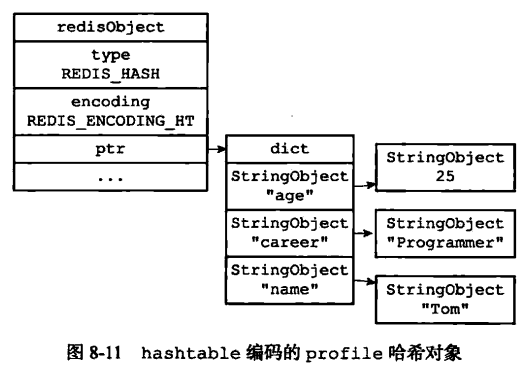
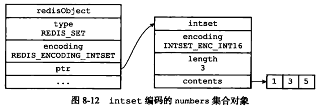

## Redis数据类型实现

> Redis有五大数据类型，也有六种数据结构，每种数据类型的实现都使用了一种或者多种数据接口。所以简单介绍下各种数据类型的实现。

### 对象的类型与编码

Redis使用前面说的五大数据类型来表示键和值，每次在Redis数据库中创建一个键值对时，至少会创建两个对象，一个是键对象，一个是值对象，而Redis中的每个对象都是由 redisObject 结构来表示

在Redis中，键是字符串对象，而值则可以使不同的数据类型

#### 数据结构

```c
typedef struct redisObject{
    //类型
    unsigned type:4;
    //编码
    unsigned encoding:4;
    //指向底层数据结构的指针
    void *ptr;
    //引用计数
    int refcount;
    //记录最后一次被程序访问的时间
    unsigned lru:22;
}robj
```

- type：记录对象的类型“String、List、Hash、Set、Zset”  `type key`判断对象类型
- encoding属性 & *prt指针：对象的prt指针指向对象底层的数据结构，而数据结构由encoding属性来决定

**编码常量：**


**数据类型对应的不同编码格式实现：**


`OBJECT ENCODING  key`  查看值对象的编码实现

### 字符串对象 string

Redis的最基础的数据类型，字符串的最大长度不超过512M

#### 编码

　字符串对象的编码可以是int，raw或者embstr。

　　1、int 编码：保存的是可以用 long 类型表示的整数值。（保存整数值）

　　2、raw 编码：保存长度大于44字节的字符串   （保存长字符串）

　　3、embstr 编码：保存长度小于44字节的字符串  （保存短字符串） 不可变的结构，因为字符串对象和Redis对象都在**同一片连续**的空间中，修改则需要重新分配空间，直接转化为raw

embstr与raw都使用redisObject和sds保存数据，区别在于，embstr的使用**只分配一次内存空间**（因此**redisObject和sds是连续的**），而raw需要**分配两次内存空间**（分别为redisObject和sds分配空间）。因此与raw相比，embstr的好处在于创建时少分配一次空间，删除时少释放一次空间，以及对象的所有数据连在一起，寻找方便。而embstr的坏处也很明显，如果字符串的长度增加需要重新分配内存时，整个r**edisObject和sds都需要重新分配空**间，因此redis中的embstr**实现为只读**。

**短字符串数据结构:**


**长字符串数据结构:**


#### 编码转换

当int编码保存的值不再是整数，或者大小超过long的范围会自动转化为raw

对于 embstr 编码，由于 Redis 没有对其编写任何的修改程序（embstr 是只读的），在对embstr对象进行修改时，都会**先转化为raw**再进行修改，因此，只要是修改embstr对象，修改后的对象一定是**raw**的

### 列表对象 list

按照插入顺序排序，你可以添加一个元素到列表的头部（左边）或者尾部（右边），底层实现是一个链表结构。

#### 编码

链表的对象编码可以是ziplist（压缩链表）和linkedlist（双端链表）

> 压缩链表：即省去了双端指针的内存，将一定数量的节点放到同一片连续内存中，内部根据偏移量来访问，不同的大节点之间仍然是用指针访问。 

#### 编码转换

当同时满足下面两个条件时，使用ziplist（压缩列表）编码：

　　1、列表保存元素个数小于512个

　　2、每个元素长度小于64字节

### 哈希对象 hash

哈希对象的键是一个字符串类型，值是一个键值对集合

#### 编码

当使用ziplist，也就是压缩列表作为底层实现时，新增的键值对是保存到压缩列表的表尾。

##### ziplist


hashtable 编码的哈希表对象底层使用字典数据结构，哈希对象中的每个键值对都使用一个字典键值对。

##### hashtable



#### 编码转换

当同时满足下面两个条件时，使用ziplist（压缩列表）编码：

　　1、列表保存元素个数小于512个  

　　2、每个元素长度小于64字节

### 集合对象 set

集合对象 set 是 string 类型，集合中的元素是无序的，因此不能通过索引来操作元素；集合中的元素不能有重复。

#### 编码

有序集合对象是有序的。与列表使用索引下标作为排序依据不同，有序集合为每个元素设置一个分数（score）作为排序依据。

集合对象的编码可以是 intset 或者 hashtable。

intset 编码的集合对象使用**整数集合**作为底层实现，集合对象包含的所有元素都被保存在整数集合中。

##### intset :



hashtable 编码的集合对象使用 **字典**作为底层实现，字典的每个键都是一个字符串对象，这里的每个字符串对象就是一个集合中的元素，而字**典的值则全部设置为 null**。这里可以类比Java集合中HashSet 集合的实现，HashSet 集合是由 HashMap 来实现的，集合中**的元素就是 HashMap 的key**，而 HashMap **的值都设为 null。**

##### hashtable: 


#### 编码转换

当集合同时满足以下两个条件时，使用 intset 编码：

　　1、集合对象中所有元素都是整数

　　2、集合对象所有元素数量不超过512

### 有序集合对象 

有序集合对象是有序的。与列表使用索引下标作为排序依据不同，有序集合为每个元素设置一个分数（score）作为排序依据。

#### 编码

有序集合的编码可以是 ziplist 或者 skiplist。

　　ziplist 编码的有序集合对象使用**压缩列表**作为底层实现，每个集合元素使用两个紧挨在一起的压缩列表节点来保存，**第一个节点保存元素的成员**，第二个节点保存**元素的分值**。并且压缩列表内的集合元素按分值从小到大的顺序进行排列，小的放置在靠近表头的位置，大的放置在靠近表尾的位

正常情况下：redis使用字典和跳跃表来实现有序集合。

字典的**键保存元素的值**，字典的**值则保存元素的分值**；跳跃表节点的 **object 属性保存元素的成员**，跳跃表节点的 **score 属性保存元素的分值**。

这两种数据结构会通过**指针**来**共享相同元素的成员和分值**，所以不会产生重复成员和分值，造成内存的浪费。

说明：其实有序集合单独使**用字典**或跳跃表其中一种数据结构都可以实现，但是这里使用两种数据结构组合起来，原因是假如我们单独使用 字典，**虽然能以 O(1) 的时间复杂度查找成员的分**值，但是因为字典是以**无序的方式来保存集合元素**，所以每次进行范围操作的时候都要进行排序；假如我们单独使用跳跃表来实现，虽然能执行范围操作，但是**查找操作有 O(1)的复杂度变为了O(logN)。**因此Redis使用了两种数据结构来共同实现有序集合。

### 五大类型的应用场景

- 对于string 数据类型，因为string 类型是**二进制安全**的，可以用来存放图片，视频等内容，另外由于Redis的高性能读写功能，而string类型的value也可以是数字，可以用作**计数器**（INCR,DECR），比如分布式环境中统计系统的在线人数，秒杀等。

- 对于 hash 数据类型，value 存放的是键值对，比如可以做**单点登录存放用户信息**。

- 对于 list 数据类型，可以实现简单的消息队列，另外可以利用lrange命令，做基于redis的分页功能
- 对于 set 数据类型，由于底层是字典实现的，查找元素特别快，另外set 数据类型不允许重复，利用这两个特性我们可以进行全局去重，比如在用户注册模块，判**断用户名是否注册**；另外就是利用交集、并集、差集等操作，可以计算共同喜好，全部的喜好，自己独有的喜好等功能。
- 对于 zset 数据类型，有序的集合，可以做范围查找，**排行榜应用，取 TOP N 操作**等。

### Redis内存回收和内存共享

```C
typedef struct redisObject{
    //类型
    unsigned type:4;
    //编码
    unsigned encoding:4;
    //指向底层数据结构的指针
    void *ptr;
    //引用计数
    int refcount;
    //记录最后一次被程序访问的时间
    unsigned lru:22;
}robj
```

 ##### refcount 属性 引用器计数法  （java是可达性分析算法）

　　1、创建一个新对象，属性 refcount 初始化为1

　　2、对象被一个新程序使用，属性 refcount 加 1

　　3、对象不再被一个程序使用，属性 refcount 减 1

　　4、当对象的引用计数值变为 0 时，对象所占用的内存就会被释放。

会存在着循环引用问题，但是Redis是通过配置maxmemory-policy，来有不同的回收操作。